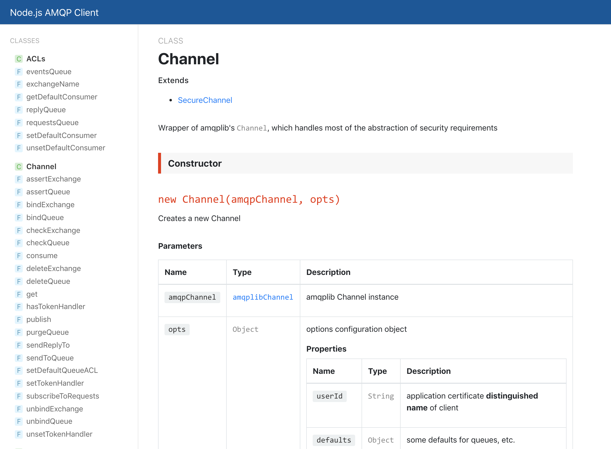
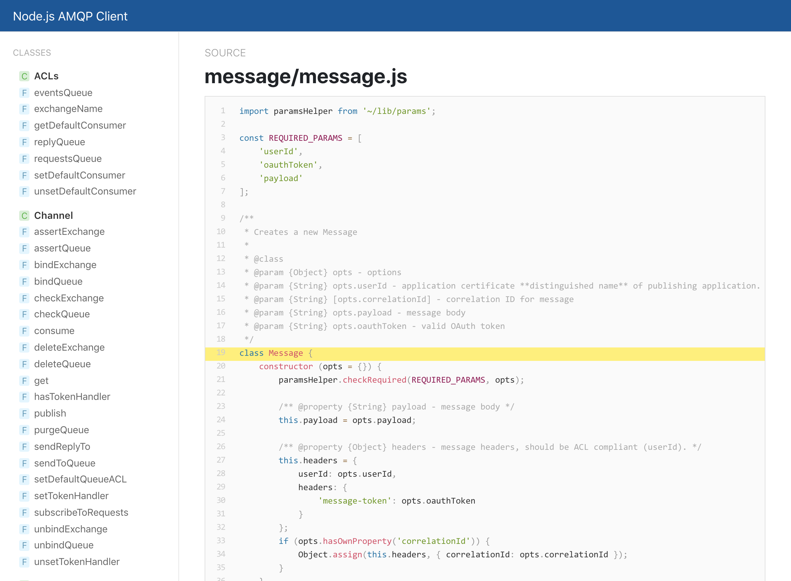

# Tidy

<a href="https://travis-ci.org/julie-ng/tidy-jsdoc" target="_blank">
  
</a>

A JSDoc3 template

Documentation doesn't have to be ugly and boring.
 Based on the default JSDoc 3 template, which uses:
- [the Taffy Database library](http://taffydb.com/)
- [Underscore Template library](http://underscorejs.org/)

## Usage

### 1. Add Dependency

To use this jsdoc template in a project, first install the package:

```
npm install --save-dev tidy-jsdoc
```

### 2. Configure JSDoc

Then in your `jsdoc.json` configuration file, change the template options to `node_modules/tidy-jsdoc`.

Here is an example `jsdoc.json`:

```json
{
	"tags": {
		"allowUnknownTags": true,
		"dictionaries": [
			"jsdoc",
			"closure"
		]
	},
	"source": {
		"include": [
			"src"
		],
		"includePattern": ".+\\.js(doc)?$",
		"excludePattern": "(^|\\/|\\\\)_"
	},
	"opts": {
		"template": "./node_modules/tidy-jsdoc",
		"encoding": "utf8",
		"destination": "./docs/",
		"recurse": true
	},
	"plugins": [
		"plugins/markdown",
		"plugins/summarize"
	],
	"templates": {
		"cleverLinks": false,
		"monospaceLinks": false
	},
	"metadata": {
		"title": "My JavaScript Library",
		"header": {
			"background": "#333333",
			"color": "#ffffff"
		}
	}
}
```

### 3. Generate Docs

Then generate documentation referring this template:

```
jsdoc --readme README.md -c jsdoc.json
```

## Preview

The following documentation were generated for an internal library used for work.





## Development

This is a bootstrap based template, so when working with sass, you can automatically build the CSS like so:

```
npm run sass:watch
```

Note: you'll have to commit both the scss and css files.
