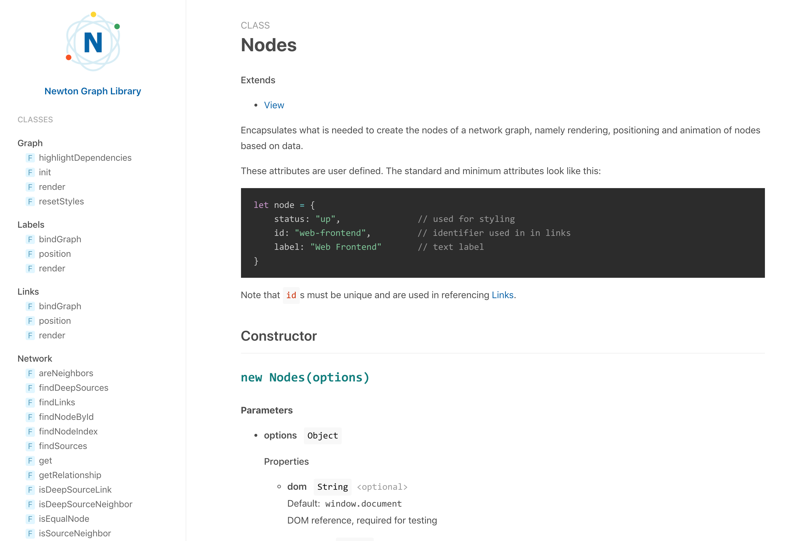

# tidy-jsdoc

[](https://travis-ci.org/julie-ng/tidy-jsdoc)
[](https://snyk.io//test/github/julie-ng/tidy-jsdoc?targetFile=package.json)

A minimalist and clearn [jsdoc](https://jsdoc.app/index.html) template. 

 ### Features

 - Custom styles via [CSS variables](#adjusting-theme-with-css-variables)
 - Code syntax highlighting via [Prism.js](https://prismjs.com/)

## Preview

Note Latest Version 1.0 is considered a _breaking change_ because the design changes significantly. 

#### Examples

- [Newton Graph Library](https://julie-ng.github.io/newtonjs-graph/)
- Using tidy-jsdoc? Open an issue to add your documentation here.



Based on the [default jsdoc template](https://github.com/jsdoc/jsdoc/tree/master/templates) and inspired in design by [vue.js documentation](https://vuejs.org/v2/api/) and [docsify](https://docsify.js.org).

#### Looking for the old design?

If you want keep the old design, version your `package.json` appropriately. Preview old designs in the [images folder](./images/).

Note: the old designs ^0.3.0 will not be updated or maintained.

## Usage

### Add Dependency

To use this jsdoc template in a project, first install the packages:

```
npm install --save-dev jsdoc tidy-jsdoc
```

### Generate Docs

Once you've configured jsdoc and added syntax to your JavaScript files, you can generate the HTML files like so, optionally including a readme file:

```
jsdoc --readme README.md -c jsdoc.json
```

### Configure JSDoc

Then configure jsdoc to use the tidy template. Below is an example `jsdoc.json` configuration file. Be sure to adjust

- **template**  
	Points to `./node_modules/tidy-jsdoc`

- **destination**  
	Output is `./docs/`, allowing for easy GitHub Pages publishing.

- **metadata**  
	Customize title, logo, etc.

- **styles**  
	Let's your customize colors, etc. See details below.

```javascript
{
  "tags": {
    "allowUnknownTags": true,
    "dictionaries": [
      "jsdoc",
      "closure"
    ]
  },
  "source": {
    "include": [
      "src"
    ],
    "includePattern": ".+\\.js(doc)?$",
    "excludePattern": "(^|\\/|\\\\)_"
  },
  "opts": {
    "template": "./node_modules/tidy-jsdoc",
    "encoding": "utf8",
    "destination": "./docs/",
    "recurse": true
  },
  "plugins": [
    "plugins/markdown",
    "plugins/summarize"
  ],
  "templates": {
    "cleverLinks": false,
    "monospaceLinks": false
  },
  "metadata": {
    "title": "My JavaScript Library",
  }
}
```

## Customize the Template

### Adjusting Theme with CSS variables

As of version 1.0, this template is styled via css variabbles, so you can adjust it to your brand. Inside your `jsdoc.json` configuration file, add an addional `styles` property, for example:

```javascript
{
  "metadata": "...",
  "styles": {
    "text-color": "#111",		
    "primary-color": "blue",
    "heading-color": "var(--primary-color)"
  }	
}
```

This would output in your document `<head>`:

```html
<style>
  :root {
    --text-color: #111;
    --primary-color: blue;
    --heading-color: var(--primary-color);
  }
<style>
```
The keys and values are arbitrary, but the CSS should be valid. For a full list of the available variables, see [_vars.scss](./static/styles/_vars.scss).


## Development

For more information about creating jsdoc templates, see the [jsdoc GitHub repository](https://github.com/jsdoc/jsdoc/tree/master/templates).

When editing SCSS, build the CSS automatically like so:

```
npm run sass:watch
```

Note: you'll have to commit **both** the scss and css files.
